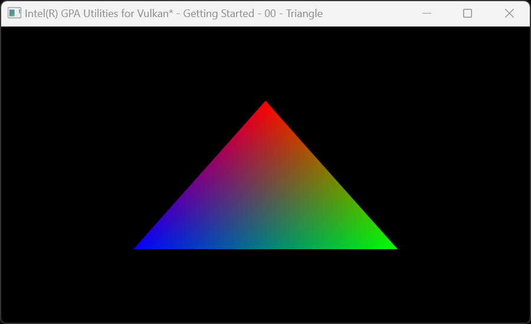
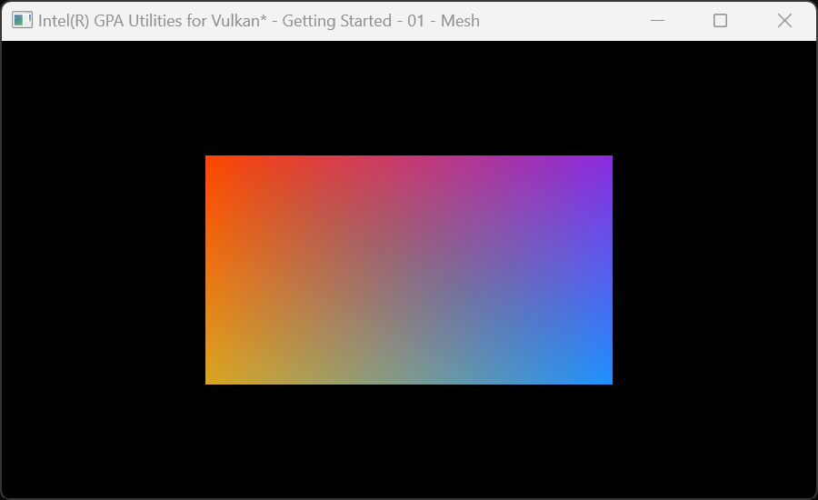
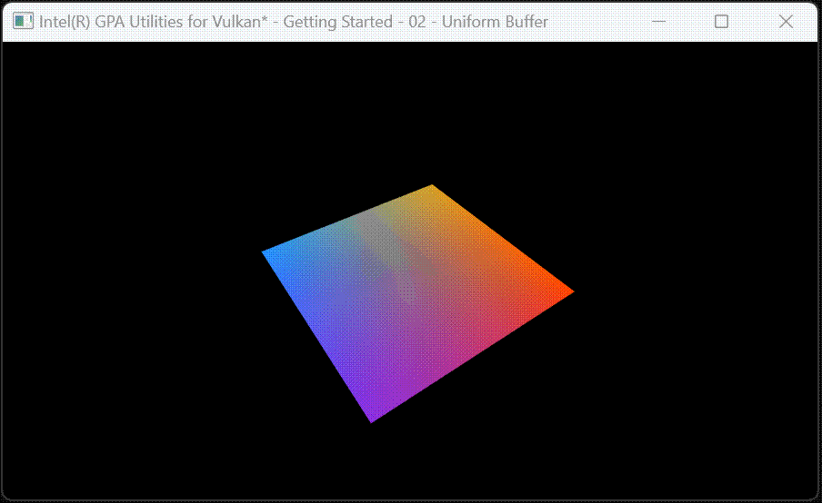
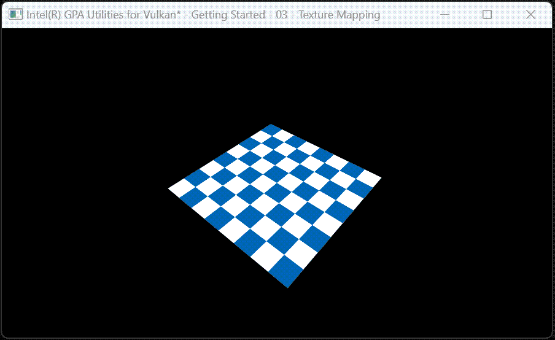
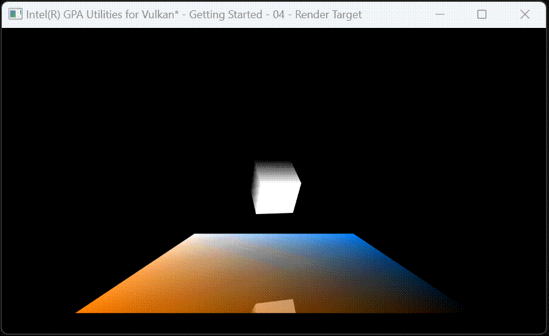
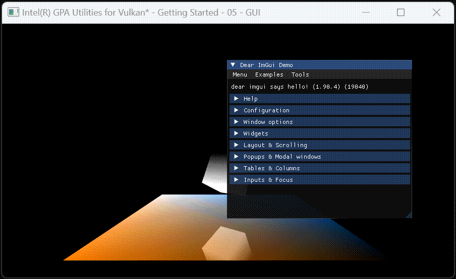

# Intel® Graphics Performance Analyzer Utilities for Vulkan*

A collection of Vulkan C++ utilities with a general focus on tools development, and a specific focus on supporting [Intel Graphics Performance Analyzers Framework](https://intel.github.io/gpasdk-doc/).

## Features
 - Vulkan structure utilities (compare/copy/serialize/stringify)
 - Managed Vulkan handles
 - Managed WSI (Window System Integration)
 - [ImGui](https://github.com/ocornut/imgui) integration
 - SPIR-V compilation via [glslang](https://github.com/KhronosGroup/glslang)
 - SPIR-V reflection via [SPIRV-Cross](https://github.com/KhronosGroup/SPIRV-Cross)
 - [Vulkan Memory Allocator](https://gpuopen.com/vulkan-memory-allocator/) integration
 - Vulkan XML parsing utilities (used to keep the project up to date with the vk.xml)
 - ...and more...

## Samples
[](samples/gvk-getting-started-00-triangle.cpp)
[](samples/gvk-getting-started-01-mesh.cpp)
[](samples/gvk-getting-started-02-uniform-buffer.cpp)
[](samples/gvk-getting-started-03-texture-mapping.cpp)
[](samples/gvk-getting-started-04-render-target.cpp)
[](samples/gvk-getting-started-05-gui.cpp)

## Getting Started

### Windows 11
- For detailed instructions see [BUILD-WINDOWS.md](BUILD-WINDOWS.md)
- Using GitBash/MinGW from the GVK root directory
> `time cmake -G "Visual Studio 17 2022" -A x64 -B build`  
> `time cmake --build build --target install`  
    - Note that the `time` command isn't necessary, but is added for conveneience
- Open the Visual Studio solution at `gvk/build/gvk.sln`
- Navigate to `gvk/samples/gvk-getting-started-00-triangle`
- Right click and select **Set as Startup Project**
- Run

### Ubuntu 24.04
- For detailed instructions see [BUILD-LINUX.md](BUILD-LINUX.md)
- Using Bash from the GVK root directory
> `time cmake -B build`  
> `time cmake --build build --target install`  
> `./build/samples/gvk-getting-started-00-triangle`  
    - Note that the `time` command isn't necessary, but is added for conveneience

## External Use
- Somewhere in your CMakeLists, add the following
```
include(FetchContent)
# See GVK's root CMakeLists for all available options
set(gvk-build-tests OFF CACHE BOOL "" FORCE)
FetchContent_Declare(
    gvk
    GIT_REPOSITORY "https://github.com/intel/gvk.git"
    GIT_TAG <desired commit hash>
)
FetchContent_MakeAvailable(gvk)
```
- Link to GVK targets
```
target_link_libraries(
    someTarget
    PUBLIC
        gvk-gui
        gvk-handles
        gvk-math
        gvk-runtime
        gvk-spirv
        gvk-structures
        gvk-system
        stb
)
```
- Note that this list includes redundant entries, for example `gvk-handles` implicitly links `gvk-runtime` and `gvk-structures` so the latter two need not be explicitly listed but are for illustrative purposes
